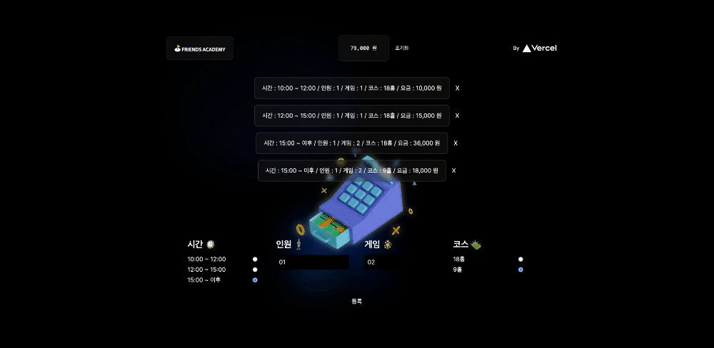
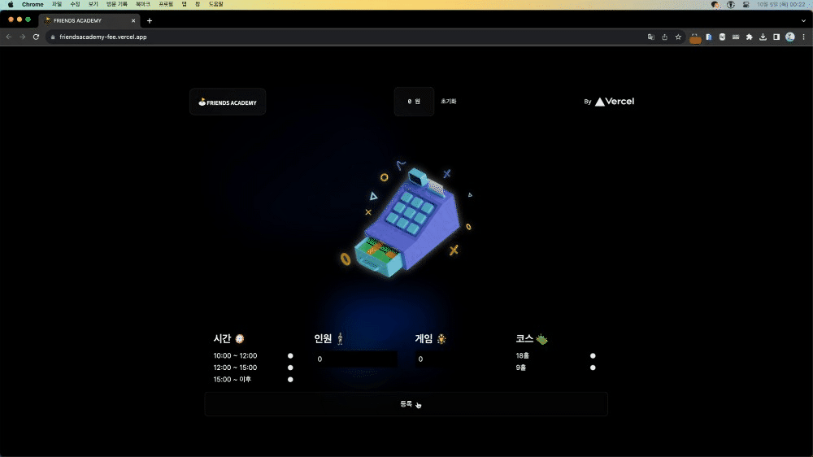

# 스크린골프 요금 계산

여자친구 아르바이트 조금이라도 편하게 하라고 만들어봤습니다.

## 요금 계산 방법

### 시간

- 10:00 ~ 12:00 : 10000원
- 12:00 ~ 17:00 : 15000원
- 17:00 ~ 이후 : 18000원

### 코스

- 9홀 : 0.5배
- 18홀 : 1배

### 계산 방법

- 시간대별 요금 _ 인원 수 _ 게임 수 \* 코스당 요금

## 구현

### 게임 추가

    등록을 누르면 게임이 추가됩니다.

    전체 게임의 합계는 해더에서 `총 요금`에 표시됩니다.

### 게임 삭제

    X 버튼을 통해 하나의 게임을 삭제할 수 있습니다.

    초기화 버튼을 누르면 모든 게임이 삭제됩니다.

### 예외 처리

    인원 수와 게임 수는 1 이상이어야 합니다.

### 반응형

    모바일 환경에서도 사용할 수 있습니다.

## 회고

1. 이후 생각해 봤는데 기본 인원과 게임을 1로 설정하고 input의 min 속성을 1로 설정하면 예외 처리를 할 필요가 없다고 생각해 예외처리를 제거했습니다.

2. 또한 시간과 코스의 default check 값을 설정해 UX를 개선했습니다.
